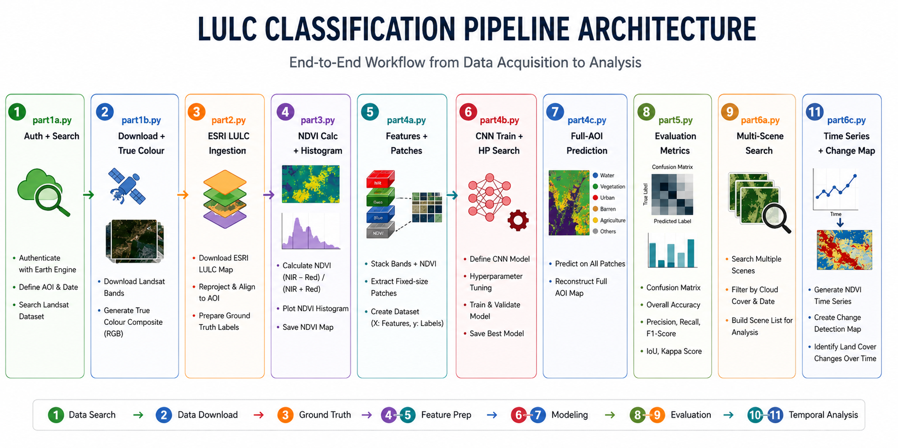

# Earth Imaging: Satellite-Based Land Use / Land Cover Classification & NDVI Analysis

> **Course:** DAT-103 · Semester 4  
> **Region of Interest:** Nara Valley, Japan (135.800 °E – 135.881 °E, 34.635 °N – 34.696 °N · ~50 km²)

An end-to-end remote sensing pipeline that acquires **Landsat 8/9 Collection-2 Level-2** imagery from the USGS, fuses it with **ESRI Sentinel-2 10 m Land Cover** labels, trains a **Convolutional Neural Network (CNN)** for pixel-wise LULC classification, and performs **multi-temporal NDVI change-detection** across seasons.

---

## Table of Contents

1. [Project Overview](#project-overview)  
2. [Key Features](#key-features)  
3. [Repository Structure](#repository-structure)  
4. [Pipeline Architecture](#pipeline-architecture)  
5. [Prerequisites](#prerequisites)  
6. [Installation](#installation)  
7. [Data Sources & Acquisition](#data-sources--acquisition)  
8. [Running the Pipeline](#running-the-pipeline)  
9. [Detailed Module Descriptions](#detailed-module-descriptions)  
10. [CNN Architecture](#cnn-architecture)  
11. [Evaluation Metrics](#evaluation-metrics)  
12. [Output Artifacts](#output-artifacts)  
13. [Configuration & Customisation](#configuration--customisation)  
14. [Limitations & Future Work](#limitations--future-work)  

---

## Project Overview

This project demonstrates a complete workflow for satellite image analysis, covering the following stages:

| Stage | Description |
|-------|-------------|
| **Data Acquisition** | Authenticate with the USGS M2M API, search for Landsat scenes filtered by cloud cover and spatial extent, and download the best-quality scene bundles. |
| **Pre-processing** | Extract spectral bands (Blue, Green, Red, NIR), clip to the AOI, apply percentile-stretch normalisation, and construct true-colour composites. |
| **Ground-Truth Ingestion** | Download the ESRI Sentinel-2 10 m global land-cover product for the same AOI and align it to the Landsat pixel grid via nearest-neighbour resampling. |
| **Spectral Index Computation** | Compute the Normalised Difference Vegetation Index (NDVI) from Red and NIR bands. |
| **Feature Engineering** | Build a 5-channel feature cube (B2, B3, B4, B5, NDVI) and extract labelled patches with minority-class oversampling. |
| **Deep Learning Classification** | Train a 3-block CNN with batch normalisation, data augmentation (random flips), class-weighted cross-entropy loss, and automated hyperparameter search. |
| **Model Evaluation** | Report overall accuracy, per-class F1, macro/weighted F1, confusion matrices, ROC/AUC curves, and IoU (Jaccard Index). |
| **Full-Scene Prediction** | Generate a wall-to-wall LULC prediction map using Test-Time Augmentation (TTA) and spatial majority-vote smoothing. |
| **Multi-Temporal Analysis** | Download Landsat scenes across five seasonal windows, compute per-class NDVI time series, and visualise vegetation phenology and change. |

---

## Key Features

-  **Automated USGS M2M authentication** - token-based login with session key management  
-  **Smart scene selection** - spatial + temporal + cloud-cover filtering with WRS-2 tile locking  
-  **True-colour & false-colour composites** - percentile-stretched RGB visualisation  
-  **ESRI 10 m LULC integration** - 9-class ground truth (Water, Trees, Crops, Built Area, etc.)  
-  **NDVI mapping & histograms** - per-pixel vegetation health with annotated colour bars  
-  **CNN-based LULC classification** - 5-input-channel architecture with hyperparameter grid search  
-  **Comprehensive evaluation** - confusion matrices, F1 bar charts, ROC curves, IoU scores  
-  **Test-Time Augmentation (TTA)** - 4-orientation averaging for more robust predictions  
-  **Spatial majority filter** - convolution-based neighbourhood voting to reduce salt-and-pepper noise  
-  **Seasonal NDVI time series** - per-class phenology curves with ±1 σ shading  
-  **NDVI change-detection maps** - first-scene vs. last-scene difference imagery  

---

## Repository Structure

```
Earth_Imaging/
├── README.md                 # This file
├── requirements.txt          # Python dependencies
├── codes/
│   ├── libraries.py          # Shared imports for all modules
│   ├── part1a.py             # USGS authentication & scene search
│   ├── part1b.py             # Scene download, extraction & true-colour composite
│   ├── part2.py              # ESRI Sentinel-2 LULC ingestion & visualisation
│   ├── part3.py              # NDVI computation, mapping & histogram
│   ├── part4a.py             # Grid alignment, feature engineering & patch extraction
│   ├── part4b.py             # CNN architecture, training loop & hyperparameter search
│   ├── part4c.py             # Full-AOI prediction with TTA & spatial smoothing
│   ├── part5.py              # Evaluation: confusion matrix, F1, ROC, IoU
│   ├── part6a.py             # Multi-temporal scene search & download
│   ├── part6b.py             # Seasonal NDVI computation per LULC class
│   └── part6c.py             # NDVI time-series plots & change-detection maps
└── data/                     # Created at runtime (not version-controlled)
    ├── landsat/              # Downloaded Landsat scene bundles
    ├── esri_lulc/            # ESRI land-cover GeoTIFFs
    └── outputs/              # All generated plots and figures
```

---

## Pipeline Architecture



---

Each script imports its predecessor (`from part<N> import *`), creating a sequential execution chain. Running any script will automatically execute all upstream modules.

---

## Prerequisites

| Requirement | Details |
|-------------|---------|
| **Python** | ≥ 3.9 |
| **USGS EarthExplorer Account** | Free registration at [earthexplorer.usgs.gov](https://earthexplorer.usgs.gov/) — needed for the M2M API token |
| **Internet Access** | Required for USGS scene download and ESRI LULC tile retrieval |
| **GPU (optional)** | A CUDA-capable GPU speeds up CNN training but is not required (CPU fallback is supported) |
| **Disk Space** | ~2–5 GB per Landsat scene bundle; ~10–25 GB for the full seasonal run |

---

## Installation

1. **Clone the repository**

   ```bash
   git clone https://github.com/<your-username>/Earth_Imaging.git
   cd Earth_Imaging
   ```

2. **Create a virtual environment** (recommended)

   ```bash
   python -m venv .venv
   # Windows
   .venv\Scripts\activate
   # macOS / Linux
   source .venv/bin/activate
   ```

3. **Install dependencies**

   ```bash
   pip install -r requirements.txt
   ```

   The full dependency list:

   | Package | Purpose |
   |---------|---------|
   | `requests` | HTTP calls to USGS M2M & ESRI APIs |
   | `numpy` | Array operations & numerical computing |
   | `matplotlib` | All visualisations (maps, charts, plots) |
   | `rasterio` | GeoTIFF I/O, CRS reprojection, raster clipping |
   | `rioxarray` | xarray-based raster loading |
   | `shapely` | Geometric operations (bounding box, intersection) |
   | `geopandas` | Geospatial data structures |
   | `scikit-learn` | Train/test split, label encoding, metrics |
   | `torch` / `torchvision` | CNN model definition, training, inference |
   | `Pillow` | Image processing utilities |
   | `scipy` | Nearest-neighbour zoom, spatial filtering |
   | `tqdm` | Progress bars |

---

## Data Sources & Acquisition

### Landsat 8/9 Collection-2 Level-2

- **Provider:** USGS Earth Resources Observation and Science (EROS) Center  
- **Access method:** [M2M (Machine-to-Machine) API](https://m2m.cr.usgs.gov/api/docs/json/)  
- **Dataset:** `landsat_ot_c2_l2` — Surface Reflectance product  
- **Bands used:**

  | Band | Name | Wavelength (μm) | Resolution |
  |------|------|-----------------|------------|
  | B2 | Blue | 0.452–0.512 | 30 m |
  | B3 | Green | 0.533–0.590 | 30 m |
  | B4 | Red | 0.636–0.673 | 30 m |
  | B5 | NIR | 0.851–0.879 | 30 m |

### ESRI Sentinel-2 10 m Land Use / Land Cover

- **Provider:** Esri / Impact Observatory  
- **Access method:** ArcGIS Image Server REST API  
- **Resolution:** 10 m  
- **Classes used:**

  | Value | Class | Colour |
  |-------|-------|--------|
  | 1 | Water | `#419BDF` |
  | 2 | Trees | `#397D49` |
  | 4 | Flooded Vegetation | `#7A87C6` |
  | 5 | Crops | `#E49635` |
  | 7 | Built Area | `#C4281B` |
  | 8 | Bare Ground | `#A59B8F` |
  | 9 | Snow / Ice | `#A8EBFF` |
  | 10 | Clouds | `#616161` |
  | 11 | Rangeland | `#E3E2C3` |

---

## Running the Pipeline

All scripts must be run **from the `codes/` directory** so that relative imports resolve correctly.

```bash
cd codes
```

### Run the full pipeline end-to-end

```bash
python part6c.py
```

> Because each script imports the previous one in sequence, running the final script (`part6c.py`) will execute the **entire pipeline** from authentication through to the seasonal NDVI change-detection maps.

### Run individual stages

| Command | What it does |
|---------|--------------|
| `python part1b.py` | Authenticate, search, download best scene, build true-colour composite |
| `python part2.py` | + Fetch and display ESRI LULC map |
| `python part3.py` | + Compute and visualise NDVI |
| `python part4a.py` | + Align grids, extract patches, split dataset |
| `python part4b.py` | + Train CNN with hyperparameter search |
| `python part4c.py` | + Generate full-AOI prediction map |
| `python part5.py` | + Evaluate model (confusion matrix, F1, ROC, IoU) |
| `python part6a.py` | + Search & download seasonal scenes |
| `python part6b.py` | + Compute per-class seasonal NDVI |
| `python part6c.py` | + Plot time series & change-detection maps |

---

## Detailed Module Descriptions

### `libraries.py` — Shared Imports

Centralises all third-party imports used across the pipeline. Suppresses warnings for cleaner console output.

---

### `part1a.py` — Authentication & Scene Search

1. Defines the **Area of Interest (AOI)** — Nara Valley bounding box.
2. Authenticates with the USGS M2M API using a **username + token** pair.
3. Sends a `scene-search` request filtered by:
   - Spatial extent (MBR filter)
   - Temporal window (Jan 2023 – Apr 2025)
   - Cloud cover threshold (< 20 %)
4. Selects the **best scene** (lowest cloud cover).
5. Fetches available download products and prefers the full **Bundle**.

### `part1b.py` — Download, Extraction & True-Colour Composite

1. Requests a download URL from the USGS and **streams** the .tar bundle to disk with progress reporting.
2. Extracts the tar archive and locates band TIF files (B2, B3, B4, B5).
3. Persists a `band_paths.json` configuration file for downstream use.
4. Defines a robust `load_band()` function that:
   - Reprojects the AOI geometry into the scene's native CRS
   - Clips the AOI to the raster footprint to handle edge cases
   - Returns the cropped band as a float32 array
5. Applies **2nd–98th percentile stretching** and stacks R-G-B into a true-colour composite.
6. Saves the composite image to `outputs/true_colour_composite.png`.

### `part2.py` — ESRI LULC Ingestion & Visualisation

1. Queries the ESRI ArcGIS Image Server for the Sentinel-2 10 m land-cover tile covering the AOI.
2. Saves the response as `lulc.tif` and prints a **class-distribution table** (pixel counts and coverage percentages).
3. Builds a custom colour map from the ESRI class palette and renders the LULC map with a labelled legend.

### `part3.py` — NDVI Computation & Histogram

1. Computes NDVI = (NIR − Red) / (NIR + Red) with nodata masking.
2. Prints summary statistics (min, max, mean, median, std) and vegetation fraction (NDVI > 0.3).
3. Generates:
   - An annotated **NDVI map** with an interpretive colour bar (Water → Lush Forest).
   - An **NDVI histogram** with threshold and mean markers.

### `part4a.py` — Grid Alignment, Features & Patches

1. **Resamples** the 10 m ESRI LULC to the 30 m Landsat grid using nearest-neighbour zoom.
2. Normalises each spectral band to [0, 1] (2nd–98th percentile) and builds a **5-channel feature cube** (Blue, Green, Red, NIR, scaled-NDVI).
3. Extracts **11×11 pixel patches** centred on labelled pixels.
4. Applies **minority-class oversampling** (with replacement) to balance the dataset (min 200, max 2000 samples per class).
5. Re-encodes labels to 0-based integers via `LabelEncoder`.
6. Splits data into **train / validation / test** sets (70 / 12.75 / 15 % stratified split).
7. Computes **inverse-frequency class weights** for balanced loss.
8. Visualises training and test pixel locations overlaid on the Landsat image.

### `part4b.py` — CNN Architecture & Training

1. Defines `LandsatCNN` — a 3-block convolutional neural network:
   - 3 conv layers (32 → 64 → 128 filters) with BatchNorm and ReLU
   - MaxPool2d + AdaptiveAvgPool2d
   - 3-layer classifier (128 → 256 → 128 → num_classes) with dual dropout
2. Implements the `train_model()` function with:
   - **CrossEntropyLoss** with class weights and label smoothing (0.05)
   - **AdamW** optimiser with weight decay
   - **ReduceLROnPlateau** learning-rate scheduler
   - **Online data augmentation** (random horizontal + vertical flips)
   - **Gradient clipping** (max norm = 1.0)
   - **Early stopping** (patience = 12 epochs)
   - Best-model checkpointing by validation loss
3. Runs a **hyperparameter grid search** over learning rate, dropout, and batch size (12 combinations).
4. Plots training curves (loss + accuracy) for every combination.

### `part4c.py` — Full-AOI Prediction

1. Runs inference on **all valid pixels** in the AOI using the best model from the HP search.
2. Applies **Test-Time Augmentation (TTA)** — averages softmax probabilities over 4 orientations (original, H-flip, V-flip, HV-flip).
3. Applies a **spatial majority-vote filter** (3×3 kernel) to smooth predictions.
4. Generates a side-by-side comparison: ESRI ground truth vs. CNN predicted LULC map.

### `part5.py` — Model Evaluation

1. Evaluates the best model on the held-out **test set** with TTA.
2. Generates:
   - **Classification report** (precision, recall, F1 per class)
   - **Confusion matrix** (raw counts + row-normalised)
   - **F1 score bar chart** with macro and weighted averages
   - **ROC curves** (One-vs-Rest) with per-class AUC scores
   - **IoU (Jaccard Index)** bar chart with mean IoU
3. Prints a final accuracy summary table.

### `part6a.py` — Multi-Temporal Scene Search

1. Parses the WRS-2 **Path/Row** from the primary scene's entity ID to ensure tile consistency.
2. Defines **5 seasonal windows** (Winter, Spring, Summer, Autumn, Winter2) spanning Dec 2023 – Feb 2025.
3. For each season, searches for the best Landsat scene on the same WRS-2 tile with < 20 % cloud cover.
4. Downloads and extracts each scene, locating the B4 (Red) and B5 (NIR) bands.

### `part6b.py` — Seasonal NDVI per LULC Class

1. Computes NDVI for each seasonal scene using `load_band()` + the standard NDVI formula.
2. Aligns the ESRI LULC raster to each scene's pixel grid.
3. Calculates **per-class mean and standard deviation** of NDVI for every season.
4. Prints a summary table of NDVI values per class per season.

### `part6c.py` — Time-Series Visualisation & Change Detection

1. Plots an **NDVI time-series graph** per LULC class with ±1 σ shading and vegetation-zone annotations.
2. Creates a **grouped bar chart** of seasonal mean NDVI by class.
3. Generates an **NDVI change-detection map** (last scene − first scene) with a diverging colour map.
4. Prints a final phenology summary: peak season, trough season, and seasonal swing per class.

---

## CNN Architecture

```
LandsatCNN(
  features: Sequential(
    Conv2d(5, 32, 3, padding=1) → BatchNorm2d → ReLU
    Conv2d(32, 64, 3, padding=1) → BatchNorm2d → ReLU
    MaxPool2d(2)
    Conv2d(64, 128, 3, padding=1) → BatchNorm2d → ReLU
    AdaptiveAvgPool2d(1)
  )
  classifier: Sequential(
    Flatten → Linear(128, 256) → ReLU → Dropout(p)
              Linear(256, 128) → ReLU → Dropout(p/2)
              Linear(128, num_classes)
  )
)
```

**Hyperparameter search grid:**

| Parameter | Values |
|-----------|--------|
| Learning rate | 1e-3, 5e-4, 3e-4 |
| Dropout | 0.3, 0.45 |
| Batch size | 64, 128 |

**Training techniques:**
- Class-weighted CrossEntropyLoss with label smoothing (ε = 0.05)
- AdamW optimiser with weight decay (1e-4)
- ReduceLROnPlateau scheduler (factor 0.5, patience 4)
- Online data augmentation (random H/V flips)
- Gradient clipping (max norm 1.0)
- Early stopping (patience 12)
- Test-Time Augmentation at inference (4 orientations)

---

## Evaluation Metrics

| Metric | Description |
|--------|-------------|
| **Overall Accuracy** | Fraction of correctly classified test pixels |
| **Per-class F1** | Harmonic mean of precision and recall per class |
| **Macro F1** | Unweighted mean of per-class F1 scores |
| **Weighted F1** | Class-frequency-weighted mean of per-class F1 scores |
| **Confusion Matrix** | True vs. predicted class counts (raw + normalised) |
| **ROC / AUC** | One-vs-Rest ROC curves with per-class AUC |
| **IoU (Jaccard)** | Intersection-over-Union per class; mean IoU (mIoU) |

---

## Output Artifacts

All outputs are saved to `data/outputs/`:

| File | Description |
|------|-------------|
| `true_colour_composite.png` | RGB composite of the primary Landsat scene |
| `esri_lulc_map.png` | Colour-coded ESRI land-cover map |
| `ndvi_map.png` | NDVI map with annotated colour bar |
| `ndvi_histogram.png` | NDVI pixel-value distribution |
| `train_test_overlay.png` | Training & test pixels on Landsat image |
| `training_curves.png` | Loss & accuracy curves for all HP combos |
| `cnn_prediction_map.png` | Ground truth vs. CNN predicted LULC (side-by-side) |
| `confusion_matrix.png` | Raw confusion matrix |
| `confusion_matrix_normalised.png` | Row-normalised confusion matrix |
| `f1_scores.png` | Per-class F1 score bar chart |
| `roc_curves.png` | One-vs-Rest ROC curves |
| `iou_scores.png` | Per-class IoU bar chart |
| `ndvi_time_series.png` | Multi-season NDVI phenology curves |
| `ndvi_seasonal_bar.png` | Grouped bar chart of seasonal NDVI |
| `ndvi_change_map.png` | NDVI difference map (last − first scene) |

---

## Configuration & Customisation

### Changing the Area of Interest

Edit the `AOI` dictionary in `part1a.py`:

```python
AOI = {
    'min_lon': <west_longitude>,
    'min_lat': <south_latitude>,
    'max_lon': <east_longitude>,
    'max_lat': <north_latitude>,
    'area_km2': <approximate_area>,
    'label': '<region_name>'
}
```

### Adjusting the temporal window

Modify `start_date` and `end_date` in `part1a.py`, and the `SEASON_WINDOWS` list in `part6a.py`.

### Changing cloud-cover thresholds

Update `cloudlimit` in `part1a.py` (default: 20 %).

### CNN hyperparameters

Modify the `HP_GRID` in `part4b.py` to add or remove learning rates, dropout values, and batch sizes.

### Patch size

Change the `PATCH` constant in `part4a.py` (default: 11). Larger patches capture more spatial context but require more compute.

### USGS credentials

Replace `usgs_user` and `usgs_token` in `part1a.py` with your own USGS EarthExplorer credentials. You can generate an M2M API token from your [USGS profile](https://ers.cr.usgs.gov/profile/access).

---

## Limitations & Future Work

- **Single-tile analysis** — the pipeline currently processes one WRS-2 tile at a time; mosaicking across tiles would enable larger-area studies.
- **ESRI LULC as ground truth** — the 10 m Sentinel-2 product is itself a model output, not a field-validated reference; using verified ground-truth data (e.g. CORINE, field surveys) would improve training quality.
- **Temporal label stationarity** — the same LULC map is used for all seasons, which may not reflect actual land-use changes between seasons.
- **Spectral bands only** — incorporating additional features such as surface temperature (Band 10), SWIR indices, or texture features could improve classification accuracy.
- **Larger architectures** — experimenting with deeper models (ResNet, U-Net) or transformer-based architectures could yield better results, especially for spatially complex landscapes.
- **Cloud masking** — the current pipeline filters scenes by overall cloud cover but does not apply per-pixel cloud masks (QA_PIXEL band).
